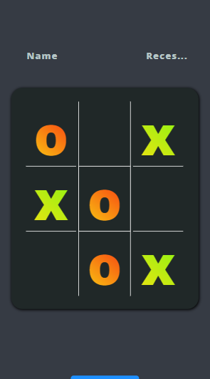

# Tic-Tac-Toe
#### preview

## Lesson Learnt
* Dom manipulation
* Array manipulation
* Dynamic Javascript
* indepth event listners
## Note
A project by The Odin Project. One of the starters for beginner to junior developers.
 
[Live demo](https://iamliam09.github.io/Tic-Tac-Toe/)